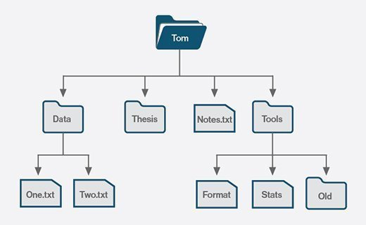

# Command Line Basics

## Introduction
Welcome to the Command Line Basics course! 🖥️ This guide will introduce you to the fundamentals of using the command line interface (CLI) on your computer's operating system. Whether you're a beginner or looking to refresh your skills, this course will help you navigate and utilize the command line effectively.

## A Brief History
The command line interface (CLI) has been around since the 1970s, providing users with a text-based method to interact with computer systems. Despite the rise of graphical user interfaces (GUI) in the 80s and 90s, the command line remains popular, especially among developers.

On your computer:


- On Mac, the command line is known as the Terminal.
- On Windows, it is known as the Command Prompt (or "CMD" for short).

Even with the prevalence of GUI applications, the command line offers several advantages:
- Automating tasks with minimal commands.
- Lower processing power consumption.
- Easier targeting of specific resources such as files and folders.
- A sense of empowerment reminiscent of movie hackers! 😎

## Getting Started
In this chapter, we will learn how to navigate the command line on your machine.

### Instructions
1. **Accessing the Command Line:**
    - For Mac users, open Spotlight with Command + Space and search for "Terminal".
    - For Windows users, download Git Bash to use the commands explored in this course. [Download here](https://git-scm.com/downloads).

2. **First Command: echo**
    - The `echo` command acts like a "print statement" and displays whatever text follows it.
    - Type the following command, replacing `...` with your name:
        ```
        $ echo Hi! My name is ...
        ```
    - Press Enter to see the command line print your name!

3. **Bonus (Mac Only): Text-to-Speech**
    - Mac users can use the `say` command for text-to-speech functionality.
    - Try running a command like:
        ```
        $ say Hi! My name is ...
        ```
    - Your computer will speak the text through the speakers!

## Next Steps
Now that you've dipped your toes into the command line, let's dive deeper into navigation and common commands. Stay tuned for the next chapter! 🚀

## 1 . Filesystem

### Directories

Your computer's filesystem is essentially a structure of folders and files. In the context of the command line, folders are referred to as directories.



Inside any given directory, you may find:

- More directories (subdirectories)
- Files containing various types of content (text, images, videos)

### Print Working Directory: `pwd`

Navigating the filesystem via the command line can be overwhelming at first. It's easy to get lost.

The working directory represents your current location in the filesystem.

The `pwd` command comes in handy to display the current working directory.

```
$ pwd
/c/Users/Aditya/AppData/Roaming/SPB_Data
```

This output indicates that the current working directory is `/c/Users/Aditya/AppData/Roaming/SPB_Data`, which is a folder within the Users directory.

###  Instructions

1. Open the command line.
2. Print the current working directory using the `pwd` command.

What is the working directory in the command line right now?


## 2 .  Moving Day

### Change Directory: `cd`

Now that we know how to open the command line and view the current directory within our computer's filesystem, let's explore how to navigate through it using the `cd` (change directory) command.

```
$ cd directory-name
```

Replace `directory-name` with the name of the directory you want to navigate to, making it the new current directory.

For example, if your username is `SPB_Data` and that's your current directory:

```
$ pwd
/Users/SPB_Data/
```

Your username directory contains more directories, including one for your computer's desktop. You can move to the Desktop directory using the `cd` command:

```
$ cd Desktop
$ pwd
/c/Users/Aditya/AppData/Roaming/SPB_Data
```

### List Content: `ls`

But how do you ensure that the directory you're navigating to exists? The `ls` command comes in handy to list all subdirectories and files under the current directory.

Assuming we're in the `SPB_Data` directory:

```
$ ls
Desktop
Documents
Images
script.js
dundie-awards.txt
```

Running `ls` shows three subdirectories (Desktop, Documents, and Images) as well as two files (script.js and dundie-awards.txt).

### Instructions

For this chapter, we'll explore a `house` directory. [Download it here](https://drive.google.com/u/0/uc?id=1pQ0gfmyBeSIZ-27W-_DB-GFGOfWOLsNW&export=download), save it to your desktop, and unzip the folder.

1. Change into the `house` directory using the `cd` command.
2. View all directories and files underneath. You should see:
```
bedroom kitchen bathroom dining-room living-room
```
